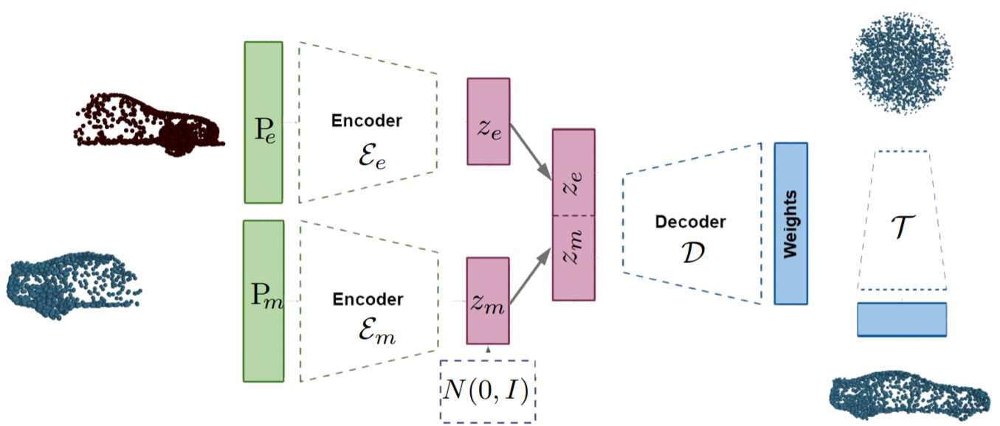

# HyperPocket: Generative Point Cloud Completion
This repository contains the source code for the paper:

[HyperPocket: Generative Point Cloud Completion](https://arxiv.org/abs/2102.05973)



#### Abstract
Scanning real-life scenes with modern registration devices typically give incomplete point cloud representations, 
mostly due to the limitations of the scanning process and 3D occlusions. Therefore, completing such partial 
representations remains a fundamental challenge of many computer vision applications. 
Most of the existing approaches aim to solve this problem by learning to reconstruct individual 3D objects in a 
synthetic setup of an uncluttered environment, which is far from a real-life scenario. In this work, we reformulate 
the problem of point cloud completion into an object hallucination task. 
Thus, we introduce a novel autoencoder-based architecture called HyperPocket that disentangles latent representations 
and, as a result, enables the generation of multiple variants of the completed 3D point clouds. We split point cloud 
processing into two disjoint data streams and leverage a hypernetwork paradigm to fill the spaces, dubbed pockets, 
that are left by the missing object parts. As a result, the generated point clouds are not only smooth but also 
plausible and geometrically consistent with the scene. Our method offers competitive performances to the other 
state-of-the-art models, and it enables a plethora of novel applications.


## Requirements
- Python 3.7+
- dependencies stored in `requirements.txt`.
- NVIDIA GPU + CUDA

## Installation
We highly recommend using [Conda](https://docs.conda.io/en/latest) or 
[Miniconda](https://docs.conda.io/en/latest/miniconda.html).

Create and activate your conda env:
- run `conda create --name <your env name> python=3.7`
- run `conda activate <your env name>`
- go to the project dir

Install requirements:
- run `conda install pytorch torchvision torchaudio cudatoolkit=<your CUDA version (e.g., 10.2)> -c pytorch`
- run `pip install -r requirements.txt`
- set your CUDA_HOME by the command: `export CUDA_HOME=... # e.g., /var/lib/cuda-10.2/`
- install CUDA extension by running `./build_losses.sh` 


## Usage
**Add project root directory to PYTHONPATH**

```export PYTHONPATH=$(project_path):$PYTHONPATH```

**Download dataset**

We use four datasets in our paper.

1. 3D-EPN
     
     Download it from the [link](http://127.0.0.1) or generate by yourself:
     1) Please download the partial scan point cloud data from [the website](http://kaldir.vc.in.tum.de/adai/CNNComplete/shapenet_dim32_sdf_pc.zip) 
     and extract it into the folder for storing the dataset (e.g., `${project_path}/data/dataset/3depn`). 
     2) For the complete point clouds data, please download it from [PKU disk](https://disk.pku.edu.cn:443/link/9A3E1AC9FBA4DEBD705F028650CBE8C7) 
     (provided by [MSC](https://github.com/ChrisWu1997/Multimodal-Shape-Completion)) and extract it into the same folder.
     3) copy `splits/3depn/shapenet-official-split.csv` file to that folder
     4) (if you haven't done it earlier) make a copy of the sample configs by executing 
        
        `cp setting/config.json.sample setting/config.json`
     5) specify your dataset preferences in `setting/config.json` file:
        ```
            ["dataset"]["name"] = "3depn" 
            ["dataset"]["path"] = "<path to your dataset folder>"
            ["dataset"]["num_samples"] = <how many devisions per a point cloud you would get (in the paper we use 4)>
        ```
     6) run `python3 util_scripts/generate_partial_dataset.py --config setting/config.json`

2. PartNet
    
    1) Please download it from [the official website](https://www.shapenet.org/download/parts) 
    
3. Completion3D
    1) Please download it from [the official website](http://download.cs.stanford.edu/downloads/completion3d/dataset2019.zip)
    2) Extract it into your folder for datasets (e.g., `${project_path}/data/dataset/completion`)
    3) (if you haven't done it earlier) make a copy of the sample configs by executing 
        
        `cp setting/config.json.sample setting/config.json`
    4) specify your dataset preferences in `setting/config.json` file:
        ```
            ["dataset"]["name"] = "completion" 
            ["dataset"]["path"] = "<path to your dataset folder>"
        ```
    
4. MissingShapeNet
   
    Download it from the [link](http://127.0.0.1) or generate by yourself:
    1) (if you haven't done it earlier) make a copy of the sample configs by executing 
        
        `cp setting/config.json.sample setting/config.json`
    2) specify your dataset preferences in `setting/config.json` file:
        ```
            ["dataset"]["name"] = "shapenet" 
            ["dataset"]["path"] = "<path to the folder for dataset>"
            ["dataset"]["num_samples"] = <how many devisions per a point cloud you would get (in the paper we use 4)>
            ["dataset"]["is_rotated"] = <set true if you want to get random-rotated point clouds>
            ["dataset"]["gen_test_set"] = <set true if you want to get a test set with point clouds divided into left and right parts>
        ```
    3) run `python3 util_scripts/download_shapenet_2048.py --config setting/config.json`
    4) run `python3 util_scripts/generate_partial_dataset.py --config setting/config.json`
    5) copy `splits/shapenet/*.list` to the specified folder
    
**Training**
    
We have prepared several settings for working with different datasets:
```
#train single class of 3depn dataset
config_3depn_airplane.json.sample
config_3depn_chair.json.sample
config_3depn_table.json.sample
    
#train model for the Completion3D benchmark
config_completion.json.sample

#train MissingShapeNet
config_missing_shapenet.json.sample
```

1) (if you haven't done it earlier) make a copy of the preferred config by executing 
    `cp setting/config_<your choice>.json.sample setting/config_<your choice>.json`

2) specify your personal configs in `setting/config_<your choice>.json`:
    - change `["dataset"]["path"]` and `["results_root"]` fields 
    - select your GPU in the field `["setup"]["gpu_id"]`
    - select the batch_size for your device in `["training"]["dataloader"]`
    - also you may change Optimizer and LRScheduler in the appropriate fields
    
3) exec script
    - run `python3 core/main.py --config settings/config.json`

**Pre-trained Models**
Pre-trained models can be downloaded from [our Release page](http://127.0.0.1). 
To use them:
    
1) Download the model weights zip file (naming convention is the same as for the configs above).
2) Extract zip file to your results directory
3) If you have not train models with sample configs you may set `["experiments]["epoch"]` to `"latest"` 
   else you need to specify the exac epoch (listed on the release page).
    
    
**Experiments**

1) In case you train the model by yourself, just change `["mode"]` in the config file to `"experiments"`
otherwise need also to specify fields mentioned above.
2) Indicate which experiments you want to run by changing bool fields 
`["experiments"][<experiment name>]["execute"]`

Experiments list:
- fixed
- evaluate_generativity
- compute_mmd_tmd_uhd (requires fixed experiment before)
- merge_different_categories
- same_model_different_slices
- completion3d_submission (generates submission.zip file in your $(project_path) folder)


## Extending
In case you want create your own experiments: 
1) write you experiment function in core/experiments
2) add it to `experiment_functions_dict` in core/experiments
3) include your special parameters into the config file `["experiments]["<your func name>"]` (be sure to add a bool field "execute" there)  
